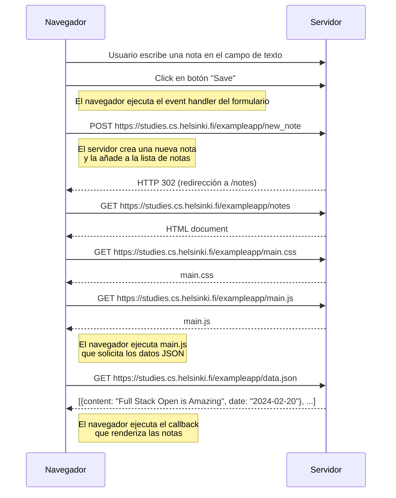

```mermaid
sequenceDiagram
 
    participant Navegador
    participant Servidor
    Navegador->>Servidor: Usuario escribe una nota en el campo de texto
    Navegador->>Servidor: Click en botón "Save"
    Note right of Navegador: El navegador ejecuta el event handler del formulario


    Navegador->>Servidor: POST https://studies.cs.helsinki.fi/exampleapp/new_note
    Note right of Navegador: El servidor crea una nueva nota<br/>y la añade a la lista de notas
    Servidor-->>Navegador: HTTP 302 (redirección a /notes)
    Navegador->>Servidor: GET https://studies.cs.helsinki.fi/exampleapp/notes
    Servidor-->>Navegador: HTML document
    Navegador->>Servidor: GET https://studies.cs.helsinki.fi/exampleapp/main.css
    Servidor-->>Navegador: main.css
    Navegador->>Servidor: GET https://studies.cs.helsinki.fi/exampleapp/main.js
    Servidor-->>Navegador: main.js
    Note right of Navegador: El navegador ejecuta main.js<br/>que solicita los datos JSON
    Navegador->>Servidor: GET https://studies.cs.helsinki.fi/exampleapp/data.json
    Servidor-->>Navegador: [{content: "Full Stack Open is Amazing", date: "2024-02-20"}, ...]
    Note right of Navegador: El navegador ejecuta el callback<br/>que renderiza las notas


```
