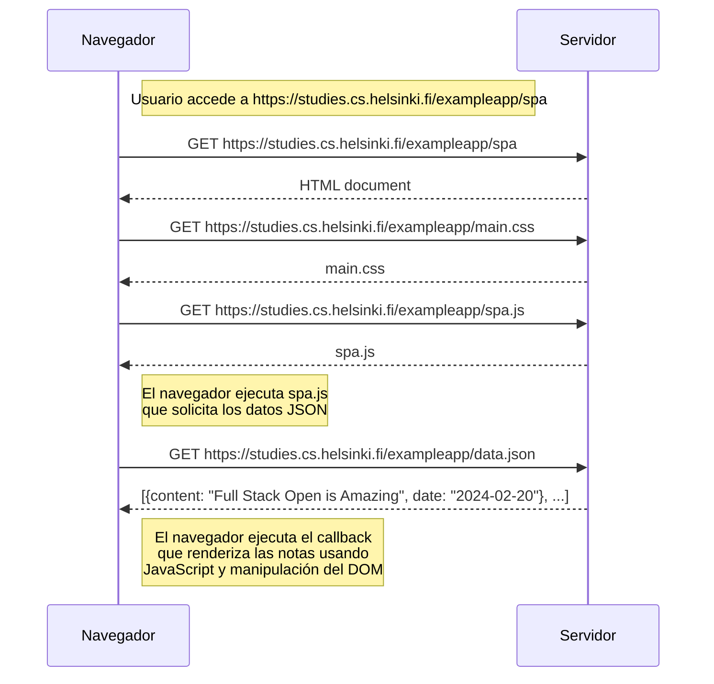

```mermaid
sequenceDiagram
    
    participant Navegador
    participant Servidor

    Note right of Navegador: Usuario accede a https://studies.cs.helsinki.fi/exampleapp/spa
    Navegador->>Servidor: GET https://studies.cs.helsinki.fi/exampleapp/spa
    Servidor-->>Navegador: HTML document
    Navegador->>Servidor: GET https://studies.cs.helsinki.fi/exampleapp/main.css
    Servidor-->>Navegador: main.css
    Navegador->>Servidor: GET https://studies.cs.helsinki.fi/exampleapp/spa.js
    Servidor-->>Navegador: spa.js
    Note right of Navegador: El navegador ejecuta spa.js<br/>que solicita los datos JSON
    Navegador->>Servidor: GET https://studies.cs.helsinki.fi/exampleapp/data.json
    Servidor-->>Navegador: [{content: "Full Stack Open is Amazing", date: "2024-02-20"}, ...]
    Note right of Navegador: El navegador ejecuta el callback<br/>que renderiza las notas usando<br/>JavaScript y manipulación del DOM

```