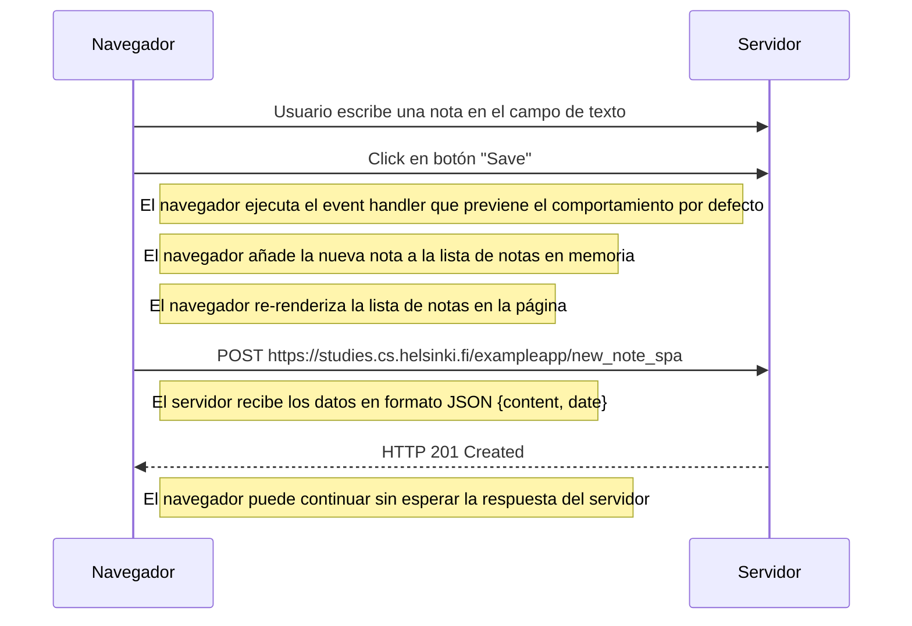

```mermaid
sequenceDiagram

    participant Navegador
    participant Servidor

    Navegador->>Servidor: Usuario escribe una nota en el campo de texto
    Navegador->>Servidor: Click en botón "Save"
    Note right of Navegador: El navegador ejecuta el event handler que previene el comportamiento por defecto
    Note right of Navegador: El navegador añade la nueva nota a la lista de notas en memoria
    Note right of Navegador: El navegador re-renderiza la lista de notas en la página
    Navegador->>Servidor: POST https://studies.cs.helsinki.fi/exampleapp/new_note_spa
    Note right of Navegador: El servidor recibe los datos en formato JSON {content, date}
    Servidor-->>Navegador: HTTP 201 Created
    Note right of Navegador: El navegador puede continuar sin esperar la respuesta del servidor
```